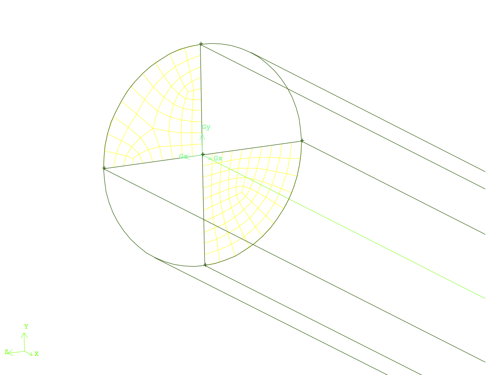
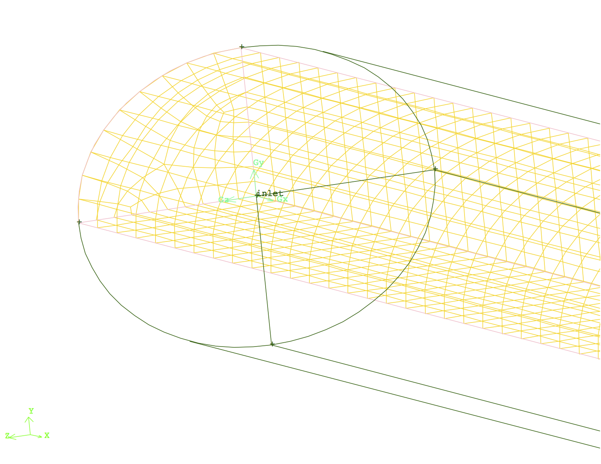

# CFD Domain's Creation & Discretization

**After the review of physics and theory behind the problem of interest, to simulate and study the flow field first a CFD/Computational domain should be created. This CFD domain is discretized into small finite elements (2D) or finite volumes (3D). The flow field's governing equations are then solved numerically inside these elements or volumes via an iterative process till a converged solution inside the CFD domain is obtained. This section explains the process of creation and discretization of CFD domain for the problem of interest.**

The CFD domain for the laminar flow in a circular pipe is a finite three dimensional cylinder with a circular cross section as shown in Fig.1. The dimensions of this pipe such as length and diameter is defined according to the problem definition. For this specific problem the ratio of length to diameter is chosen to be 50 (i.e. L = 5 [m] , D = 0.1 [m]). This ratio guarantees a CFD domain with reasonable number of of mesh elements. Furthermore, it will be long enough to simulate various aspects of the flow field as it evolves along the entrance length and becomes fully developed.

To create the geometry of the visualized CFD domain in Fig.1, it is recommended to start with a circular face divided into four equal parts/pies as four different faces. Then extrude each part/pie by the measure of pipe's length. This initial geometry discretization provides more controllability one future CFD domain discretization.

 
Fig.1 - Isometric view of the the CFD domain of the laminar flow in a circular pipe.

After the CFD domain is created, it should be discretized into finite volumes (a.k.a meshing). Technically, meshing is the process of "chopping" it into small finite elements and/or volumes, wherein the flow field's governing equations will be solved numerically. high quality mesh elements lead to a smooth and promising numerical solution. Therefore, it is important to increase the level of controllability on the raw geometry from the first step by using helping surfaces on the raw geometry of the CFD domain. For example in this problem to increase the level of controllability on the meshing process, the cylinder was divided into four identical sub-sections, as shown in Fig.2. This large discretization would provide full controllability for the future meshing or re-meshing process.

Producing a high quality 3D mesh, requires high quality and well defined surface mesh elements. Hence, for this problem the process starts with creation of finite surface mesh elements at the pipe inlet face. Boarder lines for each quarter at the inlet face are divided into 10 mesh elements as shown on right hand side of Fig.2. Then, the surfaces are meshed using appropriate meshing algorithm of choice as shown on left hand side of Fig.2.

 
 
Fig.2 - Line and face mesh on the pipe inlet faces.

The current meshing strategy, dividing the CFD domain into four sub-sections and creating face mesh, would provide us full controllability on mesh resolution close to the pipe's walls or center. Upon mesh refinement requirement one just need to concentrate more nodes on the edges close to the region of interest and re-mesh the faces and volume using the same algorithm as before.

At this stage the surface mesh is generated on the two perpendicular helping surfaces in the center of channel. The distribution of mesh element is uniform and 500 mesh elements are created along each length, while the widths of each face was meshed in the previous step. Right and left hand sides of Fig.3 visualizes the edge and surface mesh elements on the center plane.

 
Fig.3 Edge and face mesh on the central helping surfaces.

At this stage the inlet surface mesh can be extruded along the mesh elements created on central helping surfaces to create the finite volume mesh elements as visualized in right side of Fig.4. Repeating this process for the remaining three volumes would result into discretization of the entire CFD domain into finite volume mesh elements shown on left side of figure 3.

 
Fig.4 The finite volume mesh elements created using the surface mesh elements.

One the mesh is generated it's quality should be examined. This can be done using the provided features and functions defined in the meshing software. In general these functions calculate the aspect ratio of each elements and report a statistical report on them. The goal is to keep the average aspect ratio close to 1 for a very high quality mesh. In this stage the CFD domain is completely meshed and is ready to be setup for a CFD simulation.

<More explanations can be added here on the concept of mesh examination.>

> The complete mesh file (.msh) can be downloaded here [Download Mesh Here!](link)
