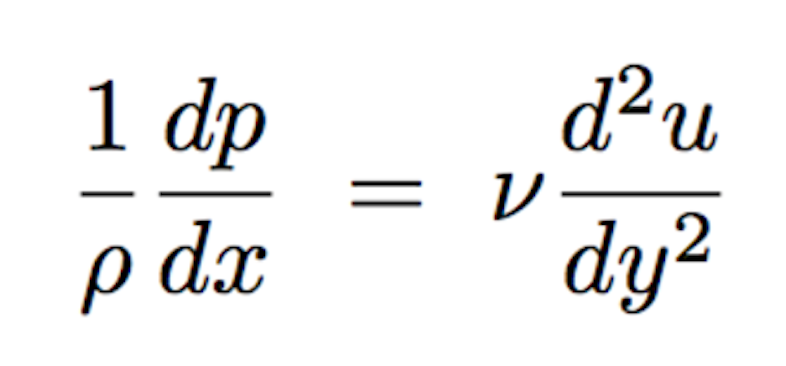
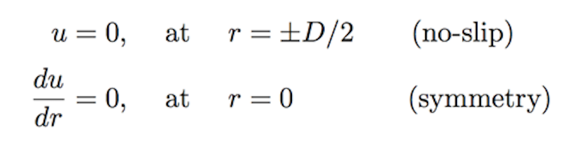
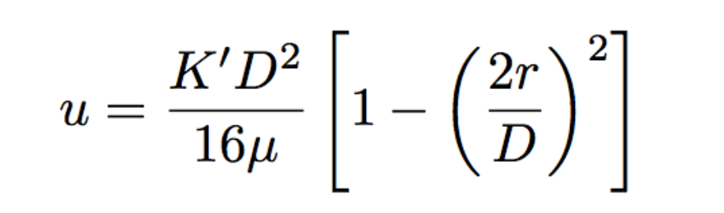

# CFD Problem's Physics & Theory

**In developing CFD simulation for a fluid mechanic problem understanding the general physics and fundamental theory of problem is extremely important. This knowledge would provide the foundation for implementation and validation of the CFD simulation. Understanding the physics and theory of the problem would provide the ability to make decision for the CFD domain, boundary conditions, numerical models and general form of expected results.**

**Understanding physics and theory of problem before developing a CFD simulation can be thought of turning on a flash light before entering a completely dark room. Hence, let's review the fundamental physics and theory behind the problem of "Laminar Flow in a Circular pipe":**

The general form of the Navier-Stokes equation as follows:

This equation indicates that the material derivative of the velocity field (i.e. the summation of external forces per unit mass in a Lagrangian reference frame) is balanced with the summation of pressure, body and viscous forces per unit mass within the flow field. For the case of laminar flow in pipes, in most of the engineering applications the incoming flow into the pipe has an almost constant and uniform velocity. However, it is probable that the incoming flow velocity has some temporal fluctuations. In these cases these fluctuations should be estimated to declare the degree of steadiness of the flow. In generic cases the assumption of steady/unifrom flow or flow with minor temporal fluctuations is a reasonable assumption. Furthermore, considering a horizontal pipe flow, the effect of body forces can become negligible. Applying these two assumptions the Navier-Stokes equation will be reduced to:

Once the flow enters the pipe due to the no slip boundary conditions at the walls of the pipe fluid velocity will instantly become zero. This results into a strong velocity gradient across the entrance length of the pipe and strongly effects the velocity field. This interaction between fluid element and solid walls forms a thin layer called Boundary Layer close to the walls of the pipe. In this region the flow field behavior is complex and flow is three dimensional. Moving further downstream the two boundary layers merge with each other and the velocity gradient becomes smoother. The velocity profile get a parabolic shape and the flow becomes "fully developed". This short region is referred to as the "entrance region". The length of this region for laminar flows is experimentally related to the Reynolds number:

For a fully developed flow, it can be assumed that velocity and pressure field variation in any directions other than the streamwise direction (i.e. x-direction in this problem) will become negligible. Therefore, the Navier-Stokes equation can be further reduced to:

In order to solve the above equation, to obtain the general velocity profile and pressure drop across the pipe we consider:

Integration of this equation will result into the general velocity profiles with two constants values. Applying two of the the following boundary conditions of the flow field:

would lead into a determined system of two equations and two unknowns and gives values for C1 and C2. Hence, the general form of velocity profile will be as follows:

In this equation K' is the only undefined variable. Considering the average velocity across the cross section of the duct one can write:

As a result of this algebraic manipulation the general form of velocity profile and pressure gradient across the pipe will be as follows:

With this review one has developed an in-depth understanding of the flow and approximate the expected results from the CFD simulations. Now one can move forward to initiate developing the CFD domain and simulations for this problem of interest.

> For more details on the physics, theory and equation derivation please see chapter 8 of "A Physical Introduction to Fluid Mechanics by Alexander J. Smits" 2nd edition. [Download Book Here!](http://www.efluids.com/efluids/books/efluids_books.htm)
