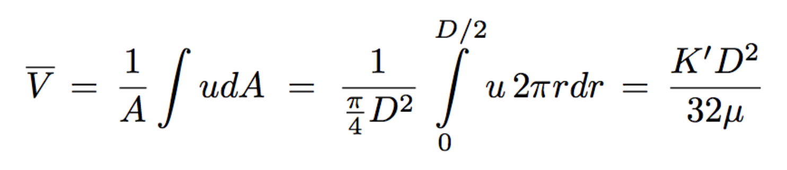
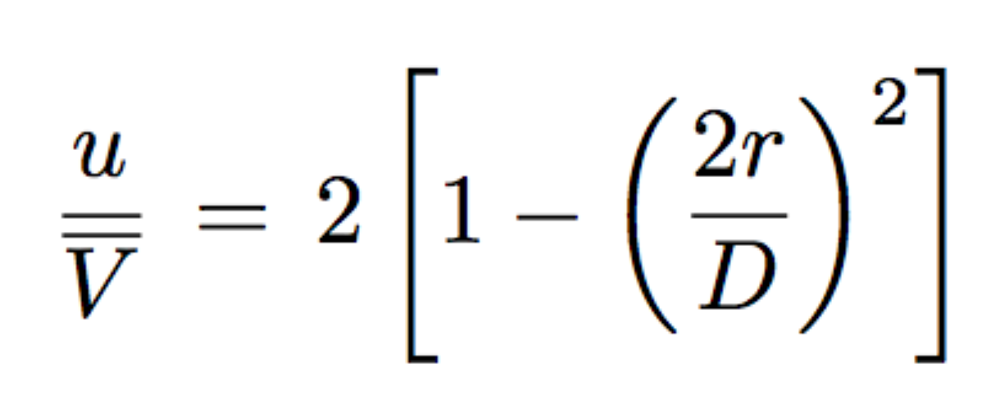
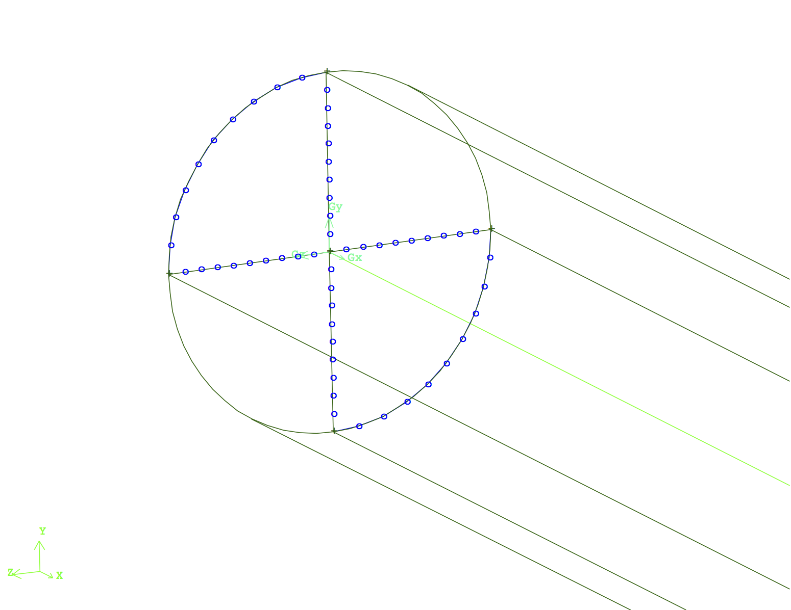
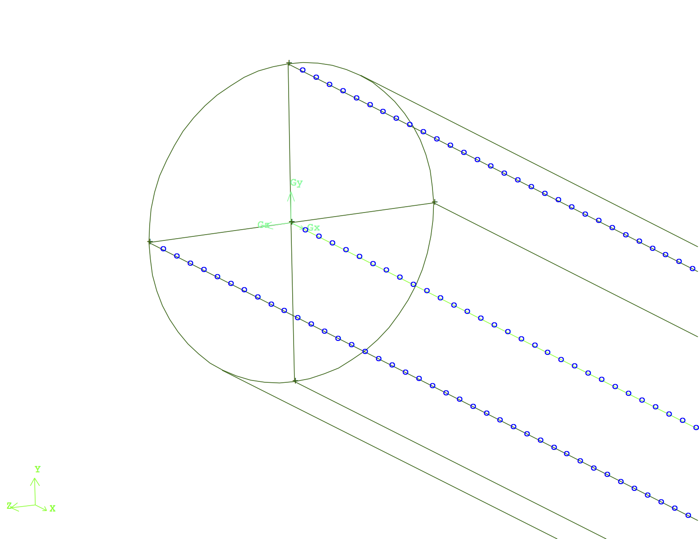
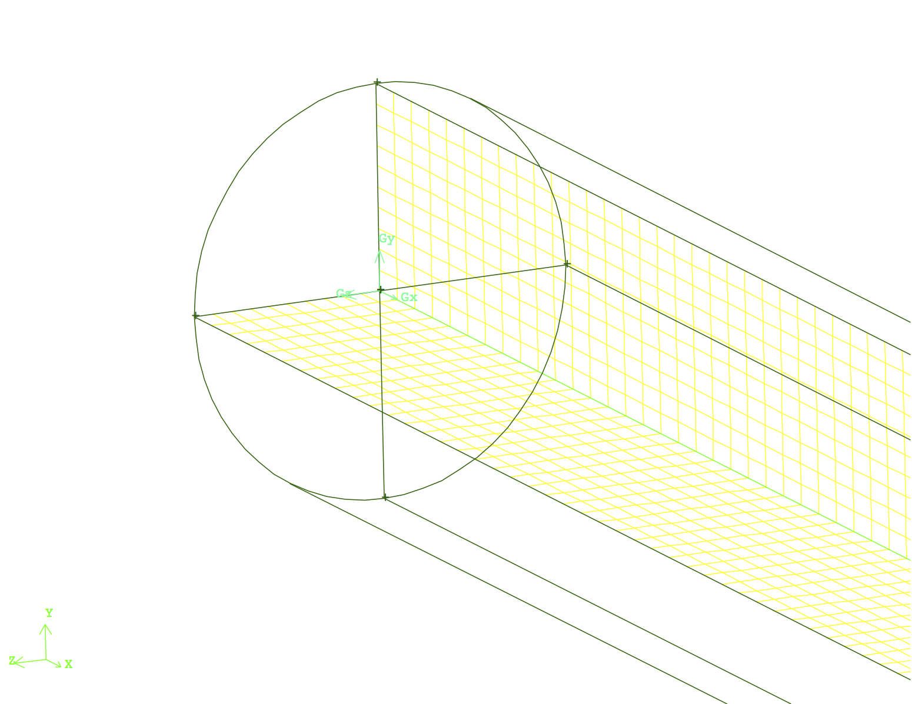
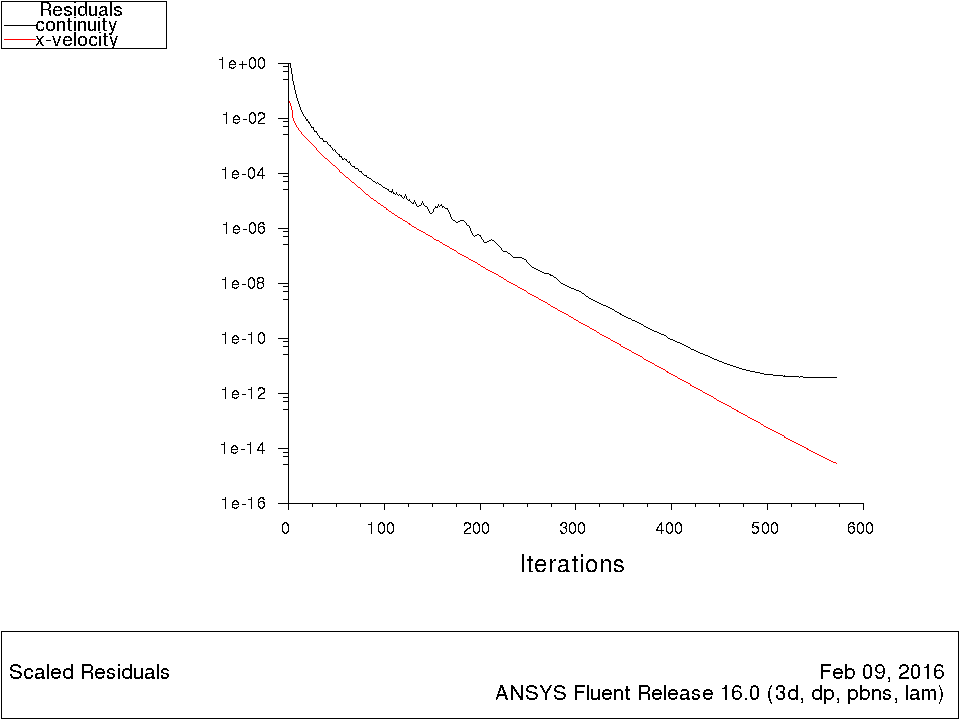

A general methodological/scientific approach to develop a CFD simulation case via ANSYS FLUENT for laminar flow in a circular pipe is explained and discussed here.

The four major steps to develop a CFD simulation case for any fluid mechanics consists the following four steps:

1. **CFD Problem's Physics & Theory**
2. **CFD Domain's Creation & Discretization**
3. **CFD Simulation Case Setup**
4. **CFD Results Post-Process**

This wiki includes the explanation of the above-mentioned steps for the problem of Laminar Flow in a Circular Pipe.

### CFD Problem's Physics & Theory

##### In developing CFD simulations understanding the problem's general physics and fundamental theory is extremely valuable and important. This would provide us the foundation for implementation and later validation of our CFD simulation. Understanding the theory would provide us knowledge to decide about the CFD domain scales, required boundary conditions and general form for numerical results. Let's review the fundamental physics and theory of the "Laminar Flow in a Circular pipe":

In order to introduce the general physics of the flow in a circular pipe start with the general Navier-Stokes equation as follows:

Assume a streamwise flow (2D), laminar and steady flow in the pipe. Then the general Navier-Stokes equation will be simplified to:

In order to solve the above equation, to obtain the general velocity profile and pressure drop across the pipe we consider:

Integrating the fourth equation would result into the general velocity profiles with two constants C1 and C2. Applying the no slip boundary conditions as follows:

[insert equation for so slip B.C.],
[insert equation for symmetry B.C.],

would lead into a determined system of two equations and two unknowns and gives values for C1 and C2. Hence, the general form of velocity profile will be as follows:

In this equation K' is the only undefined variable. Considering the average velocity across the cross section of the duct one can write:

As a result of this algebraic manipulation the general form of velocity profile and pressure gradient across the pipe will be as follows:

> For more details on the physics, theory and equation derivation please see chapter 8 of "A Physical Introduction to Fluid Mechanics by Alexander J. Smits" 2nd edition. [Download Book Here!](http://www.efluids.com/efluids/books/efluids_books.htm)

### CFD Domain's Creation & Discretization

##### After review of the physics and theory behind the problem of interest, to simulate and study the flow field a CFD/Computational domain will be created and discretized into small finite elements/volumes. The flow field's governing equations are solved numerically inside the discretized elements/volumes via an iterative process till a converged solution inside the CFD domain is obtained. This section explains the process of creation and discretization of CFD domain for the problem of interest.

The CFD domain for the laminar flow in a circular pipe is a finite cylinder with a circular cross section as shown in figure 1. The dimensions of this pipe such as the length and diameter depends on the problem definition. For this specific problem the ratio of length to diameter is equal to 50 (i.e. L = 5 [m] , D = 0.1 [m]). This ratio guarantees that the CFD domain will not have large number of mesh elements, however it will have the appropriate length to simulate various aspects of the flow field as it evolves from the inlet to the outlet of the pipe (positive x direction).

After the CFD domain is created, it should be discretized. The discretization of a CFD domain is the process of "chopping" the domain into small finite elements and/or volumes, wherein the flow field's governing equations will be solved numerically. Discretization of the domain into geometrically well defined finite elements and/or volumes leads to smoother and more promising numerical solution. Furthermore, based on the problem's complexity, physical or geometrical, controllability of the mesh resolution within the domain becomes very important. In this problem in order to increase the level of controllability of the mesh the cylinder was divided into four identical sub-sections, as shown in figure 1, that will be meshed using identical meshing strategy.

Producing a high quality 3D mesh, first requires high quality and geometrically well defined surface mesh elements. Therefore, discretization process for this problems starts with creation of finite surface mesh elements at the pipe inlet face. Boarder lines for each quarter of the inlet face are divided into 10 mesh elements as shown on right hand side of figure 2. Then, the surfaces are meshed using appropriate meshing algoritem of choice as shown on left hand side of figure 2.

 

It is important to highlight that the current meshing strategy, dividing the CFD domain into four sub-sections, would provide us full controllability on mesh resolution close to the pipe's walls or center. Upon mesh refinement requirement it is sufficient to concentrate more nodes on the surface edges close to the region of interest (the detail of these strategies will be discussed for other simulations as required).

At this stage the surface discretization is performed along the length of the channel, on the two perpendicular surfaces in the center of channel. The distribution of mesh element is uniform and 500 mesh elements are created along each length. Right and left hand sides of figure 2 visualizes the line and surface mesh elements on the center plane.

At this stage the surface meshes at the inlet surface can be extruded along the pipe length mesh elements to create the finite volume mesh elements as visualized in right side of figure 3. Repeating this process for the remaining three volumes would result into discretization of the entire CFD domain into finite volume mesh elements shown on left side of figure 3.

In this stage the CFD domain is completely discretized and ready to be setup for a CFD simulation. The CFD simulation setup will be discussed in the following section.  

> The complete mesh file (.msh) can be downloaded here [Download Mesh Here!](link)

### CFD Simulation Case Setup

##### The created CFD domain, in previous section, is now read into the CFD package of interest to start the development of the CFD simulation. It should be noted that the current tutorial has a significant difference compared to multiple other available CFD tutorials online! This tutorial is structured and developed based on a generic and methodological approach for setting up a CFD simulation. The physical fundamentals and reasonings for each setting is discussed at each step. Potential alterations and modifications are also presented. Hence, users will have the full capability of applying potential modifications, improvements or extending the application of the current the CFD simulation to more complex problems at the end of the tutorial, rather than having a one time successful run of a specific simulation with specific boundary conditions.    

> **_In simple words: Current tutorial teaches users to fish, rather than giving them a fish._**

#### Setting up a CFD simulation has following four steps:  
1. ###### Setup Model/s:   
According to the physics of the flow user will select required model/s to simulate the flow. Each model has it's own settings and inputs.

2. ###### Setup Working Fluid/s & Solid/s:   
User will define the physical and thermodynamical properties of the working fluid/s and solid/s in the problem.    

3. ###### Setup Boundary & Zone Conditions:    
Solving the governing equations of the flow requires well-defined boundary and zone conditions within the CFD domain. These conditions are selected and defined in this step.

4. ###### Setup Solution Methods:    
In CFD simulations the governing equations of the flow are solve numerically. Based on the physics of the problem right numerical schemes and solution methods are selected at this step.

Here is the CFD simulation setup for the problem of **Laminar Flow in Circular Pipe**. It should be noted that the path for defining conditions and other settings are provided in `command line` format. Users can access exact same settings and options by following the provided path via the tree of progress or pull down menu in ANSYS FLUENT:

**1. Setup Model/s:**
* The flow is steady state: `/define/models/steady`.   
* The working fluid is incompressible: `/define/models/solver/pressure-based`.
* The flow is viscous and it's regime is laminar:`/define/models/viscous/laminar`.

**2. Setup Working Fluid/s & Solid/s:**  
* The working material is Air:
`/define/material/change-create`. In this menu user can create or change all required physical and thermodynamical properties of the material/s in the model.  

**3. Setup Boundary and Zone Conditions:**    
* In this problem the entire CFD domain is filled with the working fluid. This working fluid is selected form the defined material/s in the previous step:`/define/boundary-conditions/fluid`. Select Air from the available lists of materials.

* The flow enters to the inlet face of CFD domain with constant velocity of 0.01 [m/s] in x-direction. User sets the inlet face to a velocity-inlet condition by defining the direction and magnitude of the velocity: `/define/boundary-conditions/velocity-inlet`.
In cases where the incoming velocity into the CFD domain is not uniform one can select User Define velocity profiles in this option as well.

* The flow exits the pipe from the outlet face and it's pressure will be equal to atmospheric pressure. `/define/boundary-conditions/pressure-outlet`. It is assumed that gauge pressure at this face is equal to 0.

* The flow is bounded by pipe's walls and interact with it based on the no-slip boundary condition. User assign the no-slip boundary condition to the wall faces of the CFD domain: `/define/boundary-conditions/wall`. If the shear forces and formed boundary layer becomes important in this region user should either provide required mesh resolution to capture the phenomena or set this boundary to slip condition such that fluid elements would not interact with wall region.

**4. Setup Solution methods:**   
In this step, it is highly recommended to use the default options and settings, unless based on physics of the problem the user is aware of any specific choices. Upon non-smooth convergence and potential divergence of the CFD simulation user can modify and examine various solution methods. To modify the solution methods and controls use the following commands respectively:

`solve/set/discretization-schem`

`solve/set/under-relaxation`

Now all boundary conditions and settings for the CFD simulation are defined. User can **initialize** the solution through an educated guess to start the iteration process: `/solve/initialize/compute-defaults/velocity-inlet`
Solution initialization would incept the flow field variables, such as velocity and pressure, based on the defined values by user. For the current problem the CFD domain is recommended to be initialize by values of velocity and pressure at the pipe's inlet.

Iteration process for solving the flow field governing equation now shall start till converged solution is obtained:`solve/iterate`. A general rule of thumb for converged solution is to have continuity residuals of 10-3. More details about commenting on validity of solution and convergence criteria will be discussed in next section.  

### CFD Results Post-Process
The last step for the development of a CFD simulation of a problem of interest is to process and examine the validity of the obtained numerical results (a.k.a post-processing step). This process is done starting from general inspection on CFD simulation leading to more detail validation.

The first general rule of thumb to check the convergence of a CFD simulation is to visualize the residuals for key flow variables, such as continuity, velocity and etc.. In order to plot residual values in ANSYS FLUENT do: `plot/residual` and choose the residual values of interest to plot.

Figure 4 visualizes the residual values of continuity and streamwise velocity versus the number of iterations. The general decreasing trend of residual values confirm that the numerical solution of the conservation/governing equations are converging to specific final values. Usually the residual for the mass decreases with the slower rate compare to other residual values. Therefore, a continuity residual of 10E-3, is the first necessary, but not sufficient, general criteria to confirm the convergence of the CFD simulation in general. In this case this criteria is reached after about 50 iterations and after about 500 iterations the continuity residuals reached value of 10E-12, which is a solid confirmation of CFD simulation convergence.

The second step is to visualize dimensionless form of the important variables within the CFD domain. This step can be problem specific and should be done on an adequate plane of choice. For most of the problems contour of normalized velocity or pressure is on a horizontal or vertical plane at the center of the CFD domain is a good start point.
The path to define an adequate plane is `surface/plane-bounded`. This command will ask for coordinate of three different points within the domain to create the plane. For the current CFD domain to define a vertical plane from inlet to 5D downstream the coordinates will be as follows:

x0 (m) = 0   , y0 (m) = 0 , z0 (m)=  0.05

x1 (m) = 0   , y1 (m) = 0 , z0 (m)= -0.05

x2 (m) = 0.5 , y0 (m) = 0 , z0 (m)= -0.05

Once the plane is created one should define the normalized variable of interest. To define the normalized streamwise velocity, by the inlet velocity we will have `define/custom-field-functions/define`, name your variable (i.e. normalized_streamwise_velocity) and put the following formula `x_velocity/0.01`. This will calculate the normalized streamwise velocity within the CFD domain. At this stage the command `display/contour/normalized_streamwise_velocity` will ask you for a range (i.e. [0,2]) and visualizes the velocity contours for you as shown in figure 6:

As shown in this figure, the flow enters the domain with normalized velocity of 1. Due to the imposed no slip boundary conditions on the pipe's walls, the velocity instantly decrease to zero at this region. Due to this extreme change of momentum within the vertical direction there is going to be a region at the entrance of the pipe where the flow evolves in the streamwise direction. This specific length is referred to as the entrance length. After the entrance length the velocity profile becomes fully developed and uniform to the end of the channel.
It should also be highlighted that this velocity contour is smooth. The smoothness confirms the validity of created mesh resolution and convergence of the numerical solution. However, this is an additional necessary, but not sufficient criteria for simulation validity and convergence.

After performing the general post-processing steps, the user need to perform more detail oriented post-processing to confirm the general validity of the CFD simulation. This stage can be a state-of-the-art. Comparing the numerical results against the theory (discussed earlier) or any other available experimental results is the final stage of post-processing. It is extremely important to calculate the correct corresponding numerical variables and compare them against the experimental or other numerical data.

In order to visualize the evolution of the velocity along the flow one should look at the velocity magnitude at different stations downstream the pipe. Since the flow is axi-symmetric each station is defined as a vertical line at different distances downstream the pipe. One can use `surface/line-surface` command to enter the start and end point of each measurment station as shown in the following table, where D is the distance downstream in terms of diameter:

x0 (m) = x*D   , y0 (m) = 0 , z0 (m)=  0.05
x1 (m) = x*D   , y1 (m) = 0 , z1 (m)=  -0.05

Use of `<this command>` would export the velocity values along each pre-defined station into a text file <link here>. Using a simple script (e.g. Python post-processing script) one can compare the numerical and theoretical results as shown in figure:

Figure visualize that at X diameter downstream the pipe numerically predicted velocity profile matches the theoretically calculated velocity ones. This confirms the validity of the developed CFD-simulation to predict the flow behavior in a circular pipe.

The post-processing script to written in Python can be downloaded here. As a practice try to figure out how the entrance length of the pipe is predicted using numerical solutions and how well it is compared against theoritical definition of the entrance length?
